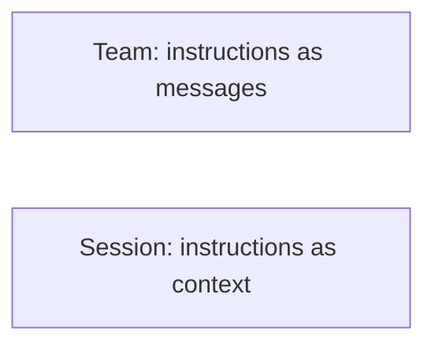

Multi-agent is the most seductive idea in AI tooling right now. If one agent is useful, surely a team of them, with a manager reviewing the work, is better. I wanted that to be true. I run a planning methodology built for autonomous execution, I had a well-specified project ready to go, and agent teams promised parallelism with built-in review.

So I ran the experiment properly: a manager agent reviewing at quality gates, a worker agent executing a fully planned project through my task system, sixty-seven tasks with detailed task documents and acceptance criteria. Real work, not a toy.

I terminated the team at 37 of 67 tasks, about an hour in. Not because the code was catastrophic. Because of how it was being produced. A single session running the same task loop would have done it better, and I want to be specific about why, because the failure modes are structural and I don't think they're unique to my setup.

## What actually happened

The worker started well: scaffolded the project, built the core scoring engine. Early on, the manager caught a real bug, a scoring constant set to 13 where the reference algorithm uses 4. Worker fixed it. That moment matters, and I'll come back to it, because it's the system working exactly as advertised.

Then the pattern set in.

**The worker treated task documents as inspiration, not instruction.** The docs specified separate files for types, scoring engine, and helpers. The worker put the enum, the result struct, ten accessor methods, the scoring engine, and a pile of stdlib wrappers into one 473-line file. It read the docs. It just decided its own approach was fine.

**Corrections didn't stick.** My tooling commits through a wrapper that tags each commit with task traceability. The worker used raw `git commit` instead. I corrected it. It kept using raw `git commit` for two more commits before finally complying. Three corrections to change one command. There is no enforcement in a message; you can only ask, and asking competes with everything else in the worker's context.

**Quality gates got speed-run.** Each sequence in my system ends with testing and review tasks. They exist to force self-review. The worker marked them complete without meaningfully performing them, delegating quality entirely to the manager.

**And the manager rubber-stamped.** After that one good catch, reviews degraded to surface checks: does it build, do tests pass. TODO comments in production code, redundant wrappers, file structure that ignored the specs, missing traceability tags. All of it sailed through gates that exist specifically to catch it.

**Even stopping was mushy.** When I sent the shutdown request, the worker kept going for two more turns, completing another task and committing it, before processing the stop. A shutdown that's a polite suggestion means every intervention costs you unwanted commits.

## The structural read

It would be easy to blame the models. I don't. The same class of model, in a direct single session, follows these same task documents with far better discipline. I know because that's how the code I ship gets built every day.

The difference is the messaging layer. In a direct session, my instructions are the context. Behind a team abstraction, my instructions become messages: one input among many, processed on the worker's schedule, weighed against its own momentum. Instruction-following that is crisp in a direct session degrades into negotiation. Every correction becomes a hope.

And here's the trap in the economics. The pitch for a manager-worker team is that the manager absorbs the review burden. In practice I had to review the manager. Shallow approvals meant the human had to re-inspect everything anyway, which means the team added a coordination layer without removing any oversight. Overhead went up. Assurance went down.

One trial, one afternoon, yes. But it matches everything I'd seen before it. An earlier multi-agent system I built myself, on a previous model generation, worked notably better than this trial and still taught me the same lesson: the coordination tax exceeds the parallelism dividend when the work requires discipline rather than brainstorming.

## What I do instead

If you need parallelism, open more terminal tabs.

I mean that literally. Multiple independent single sessions, each running its own project's task loop, each with full instruction-following discipline, each interruptible instantly. No messaging layer between you and any of them. The parallelism you actually wanted, without laundering your instructions through an agent hierarchy.

The deeper lesson generalizes past my tooling. Anything that matters, don't say it, enforce it. A convention that lives in messages will be dropped under pressure; a rule that lives in tooling cannot be. Since that trial I've been steadily moving every rule I care about out of prompts and into the tool layer: commands that carry the traceability themselves, gates that can't be marked complete without evidence. Structure holds where instructions slip.

Multi-agent architectures will presumably get enforcement primitives eventually: instructions that bind, gates that block, shutdowns that stop. I'll rerun the experiment when they do. Until then, my results say the team is a worse version of a simpler thing I already have.

---
