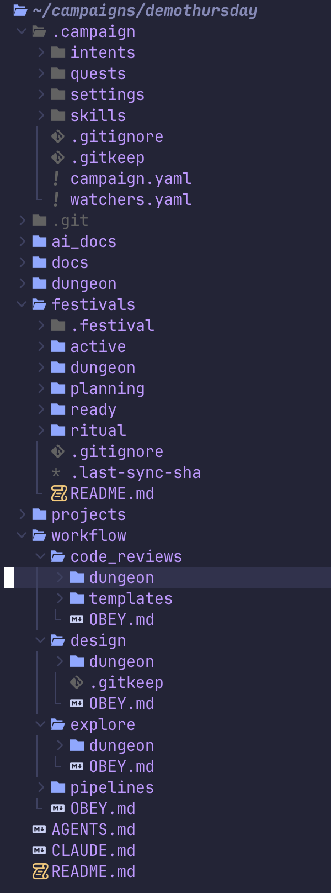
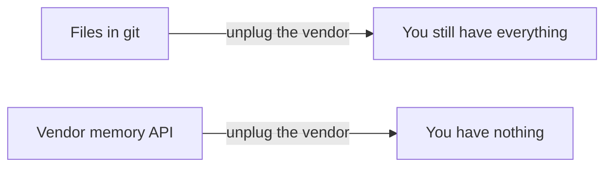

There's a gold rush on right now to be the memory layer for AI agents. Hosted context stores, memory APIs, retrieval platforms: sign up, point your agents at the endpoint, and your context problem is solved.

I think most of these products have the architecture exactly backwards, and I want to lay out the alternative I've been operating for the past two years, because it's boring, it works, and it's the opposite of a product: your agent's memory should be files, in version control, living next to the work they describe.

## The locality argument

Start with the observation that made me stop looking for a memory database. Almost everything an agent needs to remember is about something: a project, a decision, a design, a piece of work in flight. That context has a natural home, which is next to the thing it describes. The design doc belongs in the repo it designs. The record of why we chose approach A over approach B belongs where the code implementing approach A lives. The task list for a body of work belongs with that work.

We already learned this lesson once. Nobody stores a project's git history in a company-wide database. The history lives with the project, moves with it, clones with it. My working setup is that pattern one level up. Projects, plans, research, decisions, work in flight: plain files, in git. When an agent needs context, it reads files. When it produces something worth keeping, it writes files, and the commit is the memory-write. I never migrated my context into this system. It accumulates as a side effect of the work.

## What git gives you for free

It sounds primitive next to a vector database. Then you notice the bill is zero.

Every state your context has ever been in is recoverable. A memory update is a diff you can review, which matters because agents confidently write down things that are false. Files are the one interface every harness can consume, so I have swapped models and tools without rebuilding context. Retrieval, for a well-named tree, is grep. Add embeddings when scale demands it, derived from the files, rebuildable. The index is a cache. The files are the truth.

## The ownership argument

The deeper problem with hosted memory is not technical. It's about who accumulates the leverage.

Context compounds. Whatever holds your working history, decisions, and accumulated knowledge becomes more valuable, and harder to leave, every single day. That's exactly why vendors want to be your memory layer: it's the strongest lock-in position in the entire AI stack. Your model provider is swappable. Your memory layer, if it's someone's service, is not.

Which produces an irony worth staring at. The pitch for agent tooling is that it frees you from doing everything by hand. Infrastructure that captures your accumulated context inside a vendor silo rebuilds, at the storage layer, the exact dependence it was selling you out of at the interaction layer. You escaped supervising every task and in exchange your ability to work now lives behind someone else's API.

So I hold four properties as requirements, not preferences. The context belongs to the user. It's portable by default; switching models or tools never means rebuilding it. It's inspectable; I can read every byte of what my agents remember, with a text editor. And new tools plug into it rather than replacing it. Files in git are the least clever possible way to satisfy all four. That's precisely their qualification.

"Git-native" is doing real work in that sentence, and it's worth distinguishing from the "git for agent memory" branding that's starting to appear on hosted products. Git-flavored, where a service borrows commit vocabulary for data it still holds, gives you none of the ownership properties. The test is simple: clone it, unplug the vendor, and see if you still have everything.

Boring, plain, versioned files. The best memory architecture I've found is the one we've had for twenty years.

---
