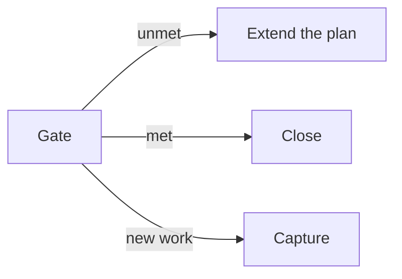

Every agent workflow eventually grows checkpoints. A review step here, an approval there, a "verify before merge" at the end. And then a quiet failure mode sets in that I've come to think of as the most dangerous thing in autonomous execution: the gates keep passing, and they've stopped meaning anything.

Agents are exceptionally good at performing review. Ask one to check its work and you'll get a confident checklist, all green. The work even builds. But a gate an agent waves itself through isn't a gate. It's a speed bump with a progress bar.

My planning system runs on quality gates: every executed body of work passes through blocking checkpoints at the sequence, phase, and completion level. Over months of running these loops daily, I've accumulated a set of rules for making gates mean something when the workers are agents. None of them are complicated. All of them came from watching the failure happen.

## Evaluate against artifacts, never from memory

The default failure looks like this: an agent finishes a stretch of work, hits the review gate, and approves based on its memory of what it did. Of course it approves. Its memory of the work is a memory of doing everything right.

The rule that fixes it: gate evaluation happens against reality, not recollection. In my system the plan lives in one directory tree and the code lives in another, and the discipline is to physically toggle between them. Read the gate's stated criteria from the planning doc. Turn each into a checklist item. Then go to the codebase and verify each one against artifacts: open the file, run the test, check the diff, query the PR. The verdict comes with evidence attached, file and line, for every criterion.

A subtlety that took me embarrassingly long to see: verification goes stale. An agent runs the test suite early in a session, does five more tasks, hits a gate, and "remembers" that tests pass. They passed before those five tasks. A gate is a fresh look by definition; anything checked before the most recent change is hearsay.

## A failed gate extends the plan, it doesn't just block

Here's a question most review processes never answer: what happens when the review finds the goal wasn't actually reached?

The instinctive answer, for agents especially, is to make the gate green anyway. File the gap as a follow-up somewhere, mark the checkpoint complete, close out the work. Every incentive points that way; the loop wants to finish. I watched an agent-run review phase surface real unfinished pieces of the stated goal, and the pull toward "note it and close" was almost gravitational.

The correct move is structural: review findings feed new phases. If the gap is part of this work's stated goal, the plan grows a new implementation phase to close it, and execution continues. The review wasn't the end of the pipeline; it was a sensor, and the sensor found something. The one judgment call that matters is scope: re-read the stated goal and ask whether the gap belongs to it. Part of the goal, extend the plan. Genuinely new work, capture it separately and let this work close honestly.

A closed plan with a known unmet goal is a lie in your records, and agents inherit your records.

## Some gates must be human, and that has to be enforced

However good the artifact-checking discipline gets, certain checkpoints exist precisely to make a human slow down and decide: did this phase achieve its goal, was the coverage right, should this advance. My tooling marks these as awaiting approval, and the instruction I give agents is literal: slow down and think hard about whether it should advance, and don't approve just to keep the loop moving.

But instructions degrade, which is a theme I keep returning to: anything that matters must be enforced, not requested. So the enforcement is mechanical. In my CLI, the command that skips a workflow gate requires an interactive terminal. An autonomous agent physically cannot bypass a blocking checkpoint; its choices are to evaluate genuinely, or to stop and surface it. That single design decision, a TTY check, converts "please take gates seriously" from a hope into a property of the system.

## Separate the powers

The best gate-discipline setup I've run used two agents with deliberately split authority. One agent worked the gates: criteria, checklists, evidence, verdicts. The other kept extending the plan based on what the review surfaced, and was explicitly forbidden from touching gate approvals. The extender couldn't approve its own extensions; the approver had no stake in the plan growing.

That's not an AI trick, it's separation of duties, older than software. What's new is how cheap it has become. Splitting maker from checker used to cost a second person; now it costs a second session. If a review matters, don't ask the maker to perform it, and don't ask the checker to build. The context that makes an agent productive on a task is precisely the bias you don't want reviewing that task. A fresh session with no memory of the shortcuts has no shortcuts to defend. Structure beats discipline in agent systems, every time it's available.

## The test

If your agent pipeline has review steps, here's the audit, and it takes one minute. Find the last ten gate passes and ask three questions. Was each verdict backed by evidence gathered after the last change, or by memory? Could the entity that did the work approve the review of that work? And when a review found a real gap, did the plan grow, or did the gap get filed somewhere gates don't reach?

Green checkmarks are the cheapest thing an agent produces. Evidence is the expensive thing. Pay for the expensive thing; it's still the best deal in the building.

---
