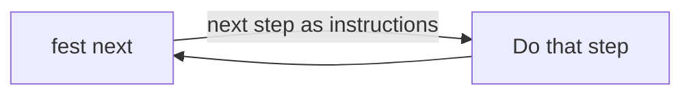

Prompt engineering optimizes a turn. That was the right skill when a session was a conversation: you got one response per prompt, so you made each prompt count.

That's not how I use agents anymore. The unit of work I care about is the run: an agent executing a planned body of work, task after task, for hours, without me in the loop. Getting that to happen reliably is a different discipline. I've started calling it loop engineering, because the thing you are actually designing is not a prompt. It's a loop, with a driver, a body, exit conditions, and failure modes.

Here is the loop I run daily, and what it taught me.

## The shape of a working loop

My planning system stores work as documents on disk. Each task has its own acceptance criteria. The CLI exposes one command, `fest next`. It does not print a path for you to go open, and it does not dump the file. It returns the next step in the loop as agent instructions. The standing instruction is:

1. Run `fest next`.
2. Execute the step it returned.
3. Go to 1.

The loop has exactly three exit conditions: a genuine blocker (missing information, ambiguous spec, external dependency), an action that needs human confirmation, or `fest next` reporting there is nothing left.

That's the whole design. It looks almost too simple to deserve a name. But every element earns its place, and I know that because I've watched agents break the loop at every single joint.

The body of work lives in that tree. `fest next` pulls the next step out of it and returns it as instructions. Review and commit are steps in the same tree, not a vibe at the end.

## How agents break loops

**They checkpoint.** The default instinct of every agent I've run is to stop after each task and ask whether to continue. That instinct is right for a conversation and fatal for a run. The loop instruction has to explicitly grant continuation: do not stop to ask, pull the next task. And it has to define what does justify stopping, or the agent will either never stop or stop constantly.

**They re-plan work that is already planned.** Given a whole planned body of work, an agent wants to read everything and form its own grand plan. But the planning already happened, in a separate phase, with its own review. Execution time is not planning time. The driver command exists precisely so the agent trusts the sequence instead of second-guessing it. One task in view at a time.

**They work from the task name instead of the step.** A name like `02_implement_scorer` is enough for an agent to start writing a scorer. It is not enough to know the file layout the design specified, the edge cases that matter, or what "done" means. `fest next` already put those in the instructions it returned. Treating that output as a title and ignoring the rest produces work that looks complete and fails review.

**They drift on tooling.** My loop commits through `fest commit` so every commit carries a pointer back to the task. Agents drift back to raw `git commit` constantly; the generic action is a stronger prior than the project-specific one. Repetition in the instructions helps but does not fix it. What fixes it is enforcement in the tool layer. A convention an agent can forget is a bug in your loop, not in the agent.

**They declare victory early.** An agent finishes one task and reports the request complete, because in conversation terms it did complete a request. The loop framing has to make the run the deliverable: the work is done when the driver says there are no more tasks, and the final report covers the run, not the turn.

## What the loop buys you

Notice what none of these failure modes are: model capability problems. The same model that breaks a loosely specified loop executes a well-specified one for hours. Every fix above is structural. The driver command, the on-disk task docs with acceptance criteria, the commit tool, the explicit exit conditions. Loop engineering is mostly the art of moving obligations out of the agent's memory and into the structure around it, because structure doesn't forget and doesn't drift.

A prompt-engineered turn improves one response. A well-engineered loop is infrastructure: it survives model upgrades, it transfers across projects, and its guarantees compound. When the loop commits with traceability on every task, an auditable evidence trail falls out for free. When exit conditions are explicit, unattended operation stops being reckless, because you know exactly which situations come back to you.

You don't need the whole vision to start. Take the run you currently babysit turn by turn, and ask what one command would have to exist, what one document would have to be on disk, and what one rule would have to move into tooling, for the agent to keep going without you for an hour.

Then build those three things and time it.
