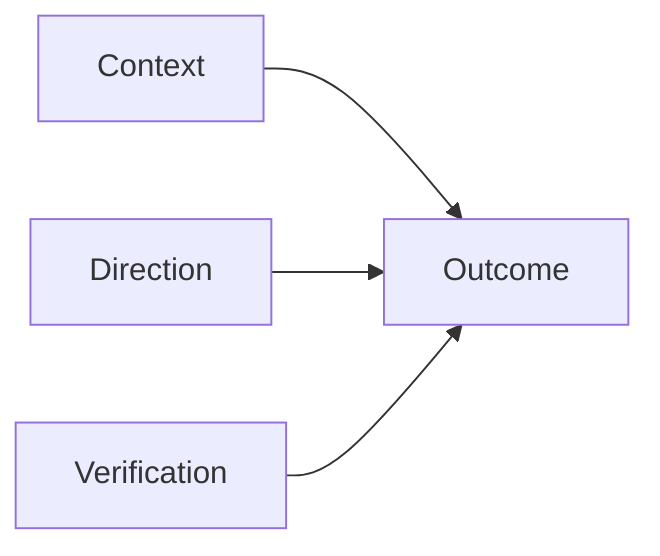
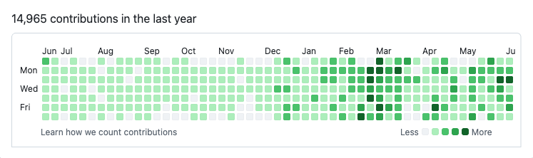
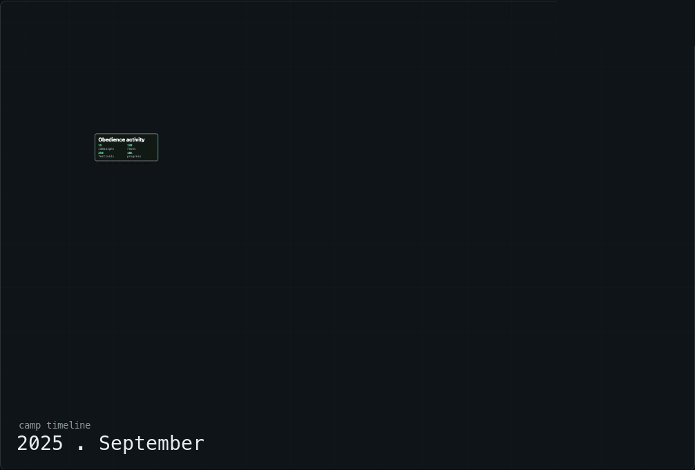
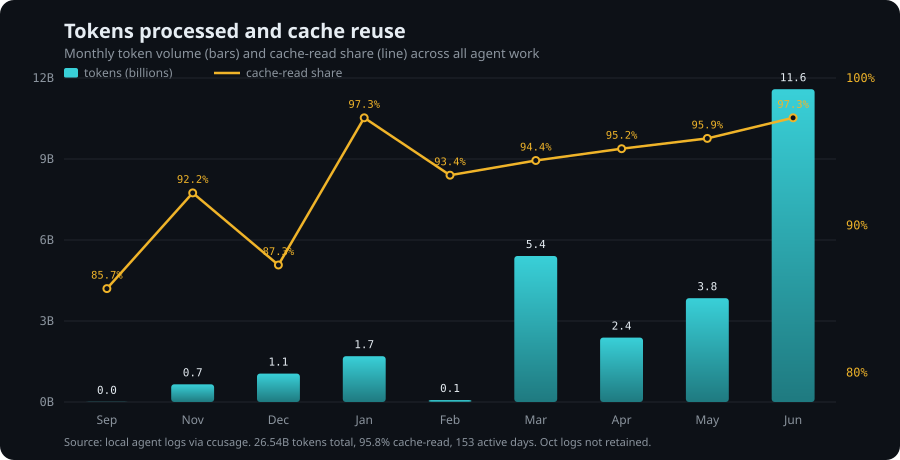
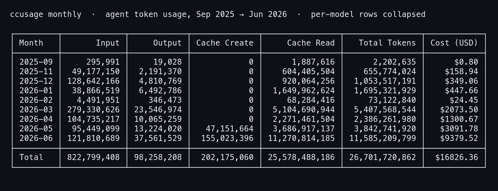

If you have used an AI coding agent on anything bigger than a quick script, you have felt this. The agent does real work. It writes the code, runs the tests, hits the API. Then it stops, hands you the result, and waits. You review it, correct it, point it at the next thing, and review again. Do that across a handful of projects and you are no longer the engineer. You are the thing holding all the loose ends together, and that job grows every time the agents get faster.

The capability is not the problem anymore. The agents can do the work. The problem is everything around the work: giving them the right context, keeping them pointed at the goal across many steps, and being able to trust and verify what came back. When you supply all of that by hand, one prompt at a time, you become the bottleneck.

Festival is what I built to move that bottleneck off of me. This post is a field report on what nine months of using it actually looked like, taken straight from the logs.

## What Festival is

Festival is a free, open command-line tool (`npm install -g @obedience-corp/festival`, or `brew install --cask Obedience-Corp/tap/festival`) that gives AI agents a structured place to work. It sits alongside whatever agent you already use, Claude Code, Codex, or anything that can run shell commands. It does not replace the agent. It gives the agent the structure it was missing.

The idea is that solving a hard, multi-step problem with AI takes three things, and Festival provides a layer for each:

- **Context.** Festival creates a workspace it calls a *campaign*: one git-tracked directory that holds your projects, docs, and research together, so an agent starting a session has the full picture instead of a blank slate.
- **Direction.** You describe an outcome, and Festival turns it into a *festival*: a structured plan broken into phases, then sequences, then individual tasks. Agents execute that plan step by step, and because it lives in files, they can pause and resume without losing the thread.
- **Verification.** Every step lands as a reviewable file committed to git. You can trace what was decided, what was done, and why, and audit any of it after the fact.

Context, direction, verification. The pitch is that getting all three right means dramatically fewer tokens and far less of your time spent babysitting the agent to the finish line.




## What it looks like to use

The loop is small enough to describe in a paragraph. You create a campaign and add your projects to it. You create a festival for the thing you want to build and let the tool generate the plan skeleton. You fill in the goal, validate the structure, and then point your agent at it. The agent works one task at a time, marks each done, and commits as it goes. When you come back, the state is all there on disk: which tasks are finished, which decisions were made, what is next. You are reviewing a structured trail, not reconstructing where the agent left off from a wall of chat scrollback.

That structure is the actual product. The numbers below are only interesting because of what they say about whether the structure holds up when you lean on it hard, for a long time.

## Does it hold up? Nine months of real use

I do not just build the Festival tools, I run everything through them. The data that follows spans my whole working life over this period: fifteen separate campaign workspaces, from the Obedience Corp product itself to client consulting, a crypto project, and personal tooling, holding 138 repositories and 256 festivals between them. It was captured from local agent logs and git history between September 30, 2025 and June 25, 2026. Not a demo. The real record.

### What nine months of organized work looks like

Start with the raw output. Here is my GitHub activity for the year:



That is 14,965 contributions in the trailing year, 706 of them pull requests, spread across a lot of different projects. Most of it is in private repositories, so the public count alone, about 5,000, badly understates it.

That is also the problem in one image. It is a huge amount of work across a huge number of projects, and if I tried to explain why each one exists and how it connects to the rest, it would take forever and lose you a third of the way through. Removing exactly that cost is the point of Festival. It keeps all of this organized so I never have to hold it in my head, and so the work can be shown instead of narrated.

Here is the same body of work as a graph, with every piece linked to the campaign workspace it belongs to:



This is `camp timeline`, scrubbed across the nine months. Every node is real work, and every node hangs off the campaign workspace it lives in. The root fans out into fifteen separate workspaces, each into its repositories, and the slider walks the whole thing forward month by month. By June it covers 138 repositories and 256 festivals.

The point is not the node count. It is that none of it had to be explained to make sense. Each branch is a structured plan with its decisions and tasks recorded in files, every contribution sitting under the workspace and the intent that produced it. That is what makes running this much, across this many fronts, survivable for one person.

### The overhead stayed flat as the work grew



This is where the structure earns its keep. Over the nine months the agents processed 26.7 billion tokens across 153 active days of work. Here is that number straight from `ccusage`, the tool that reads the local logs, with the per-model rows collapsed for width:



The number that matters is not the total, it is this: **95.8% of those tokens were cache reads.** A bit of translation, since that figure is meaningless without a baseline. When an agent takes a step, it re-reads the context it needs. A *cache read* is context the system had already loaded and held onto, rather than rebuilding it from scratch. A high cache-read share means the agents spent their budget reusing stable, already-established context instead of regenerating it every step.

Why care? Because the usual failure mode on a long project is the reverse. As a codebase grows, agents burn more and more of every request just re-deriving what the project even is, and the cost of each change creeps upward. Here that share stayed high for nine straight months and actually climbed as the work grew, finishing above 97%. The context the agents worked from stayed reusable instead of bloating. New work plugged into a stable base rather than forcing a rebuild of it.

I want to be honest about what this is and is not. Heavy agent-driven coding tends toward high cache reuse in general, and this figure spans every model and provider I used, not Festival in isolation. The claim is not that one percentage proves a tool. The claim is the shape of all of it together: nine months, one person, output rising, overhead flat, every step recorded and auditable. That is the property you need if a single person is going to sustain this much work without drowning in it.

## Try it, and star it

If the problem at the top of this post is familiar, the fastest way to get it is to run Festival on something real and watch the work organize itself. It is free and open source.

**Star the repo** so other people building with agents can find it. One click on the Star button helps more than you would think: [github.com/Obedience-Corp/festival](https://github.com/Obedience-Corp/festival)

**Install it:**

```bash
# npm
npm install -g @obedience-corp/festival

# or, on macOS
brew install --cask Obedience-Corp/tap/festival
```

**Create a workspace and your first plan:**

```bash
camp init my-project && cd my-project
fest create festival --name "my-first-feature" --type standard
```

The full quickstart takes about five minutes.

### Links

- **Festival:** [fest.build](https://fest.build)
- **Quickstart and docs:** [docs.fest.build/getting-started/quickstart](https://docs.fest.build/getting-started/quickstart)
- **Source, star it:** [github.com/Obedience-Corp/festival](https://github.com/Obedience-Corp/festival)
- **Obedience Corp:** [obediencecorp.com](https://obediencecorp.com)

The agents were never the bottleneck. The structure around them was. That is the part Festival is built to give you.
